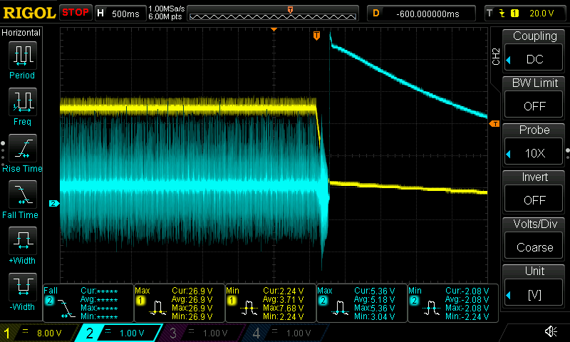

# scpi-mcp

**LabLink gives agents a SCPI wire; scpi-mcp gives agents oscilloscope expertise.**

`scpi-mcp` is a [Model Context Protocol](https://modelcontextprotocol.io) server
that lets an agent *operate an oscilloscope* — not just push SCPI strings at one.
It exposes goal-level tools (capture this signal, measure that, characterize a
channel) backed by a clean, instrument-agnostic interface. All vendor SCPI lives
in the underlying instrument library; the MCP layer stays a thin, uniform wrapper
with **no raw-SCPI escape hatch**.

```
        .-"""-. 
       / .===. \      Skippi  🧚‍♂️
       \/ 6 6 \/      the artistic scope gremlin
       ( \___/ )      "every waveform is a portrait of the magic pixies"
    ___ooo___ooo___
```

> **Skippi** is the mascot — the artistic gremlin who lives in the scope and
> paints pictures of the magic pixies (the ones who carry every electron down
> the probe). When you see a clean trace, that's Skippi's latest masterpiece.

## Scope

First instrument: **Rigol DS1054Z** (unlocked to DS1104Z base) — 4 analog
channels, 100 MHz. No `:SOURce` (function generator) or `:LA` (logic analyzer)
support. Reachable over USB or LAN (`TCPIP::<ip>::INSTR`).

## Architecture

- **`transport/`** — owns discovery. Enumerates USB, falls back to best-effort
  LAN auto-discovery, then to an IP prompt; resolves a single VISA *resource
  string* and hands it to the instrument layer. Discovery never leaks upward.
- **`instruments/`** — vendor-specific backends behind one abstract `base.py`
  interface. `rigol_ds1000z.py` is a thin wrapper over the (complete) library;
  `mock.py` implements the same interface with zero hardware. Adding an
  instrument is one new file here and **zero** changes to `tools/`.
- **`tools/`** — instrument-agnostic MCP tools that call only `base.py`.
- **`config.py`** — permission tiers (`read_only` / `read_config` / `full`),
  enforced at the tool layer. The *server* refuses; the model never decides.

## Status

Part 1 (this scaffold) runs entirely against a `MockInstrument` — no hardware,
no live VISA. Library completion (Part 2) and hardware-in-the-loop wiring
(Part 3) are bench tasks. See `SCAFFOLD_TASK.md`.

## Quickstart

```bash
uv sync
uv run pytest          # all green against the mock, zero hardware
uv run scpi-mcp        # start the MCP server (mock backend by default)
```

## Skippi in the Wild

Real captures from the bench, analyzed live via scpi-mcp.

### Power-off — relay coil with freewheel diode

**The setup:** A 24 V relay coil (with freewheel diode installed) powered from a
bench supply. Probed at the moment of power-off to observe inductive kickback.
CH1 watches the supply rail; CH2 sits across the freewheel diode.

**The prompt:**

> "Shot of the scope's screen — is that a spike up to like 60 V?"

scpi-mcp called `capture_screen` and `measure_snapshot`, then explained the
visual illusion: CH2 is set to 1 V/div, so its 5.36 V kickback spike fills
5+ of the 8 vertical divisions and *looks* enormous. CH1 is at 8 V/div, so
the 24 V rail only occupies ~3 divisions despite being far larger in absolute
terms. No 60 V spike — the freewheel diode clamped it cleanly to
V_supply + V_f ≈ 24.7 V, right where it should be. Skippi's portrait of a
diode doing its job.



*500 ms/div (5 s full sweep). CH1 yellow, 8 V/div: 24 V supply decaying from
26.9 V → 2.24 V. CH2 cyan, 1 V/div: freewheel diode kickback, max 5.36 V,
min −2.08 V.*

> Power-on capture coming — bench experiment with a bare coil (no freewheel
> diode) and a normally-closed momentary pushbutton planned to observe the raw
> unclamped L·di/dt spike.

## License

MIT
