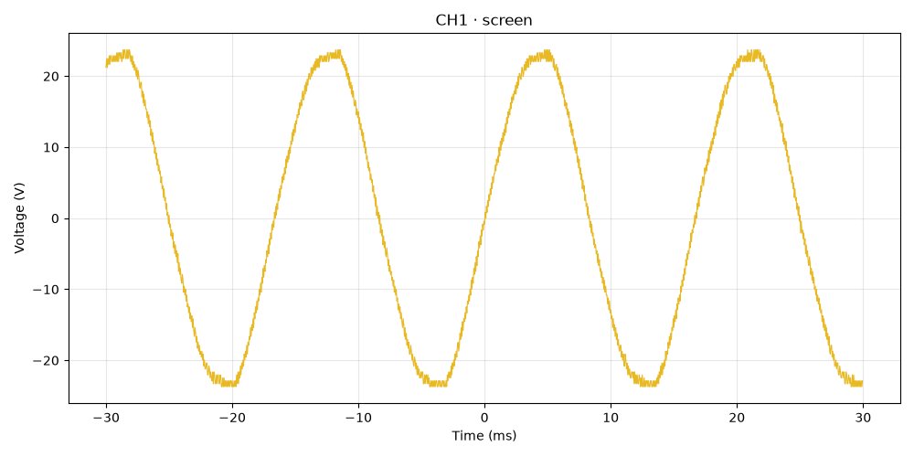
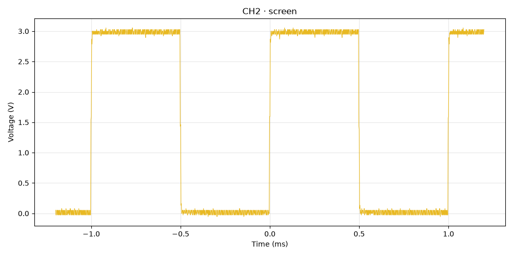
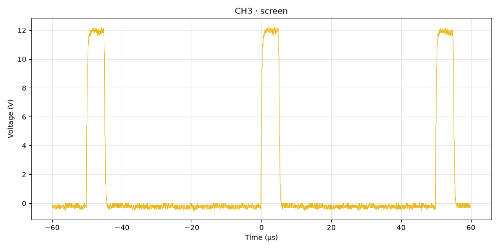
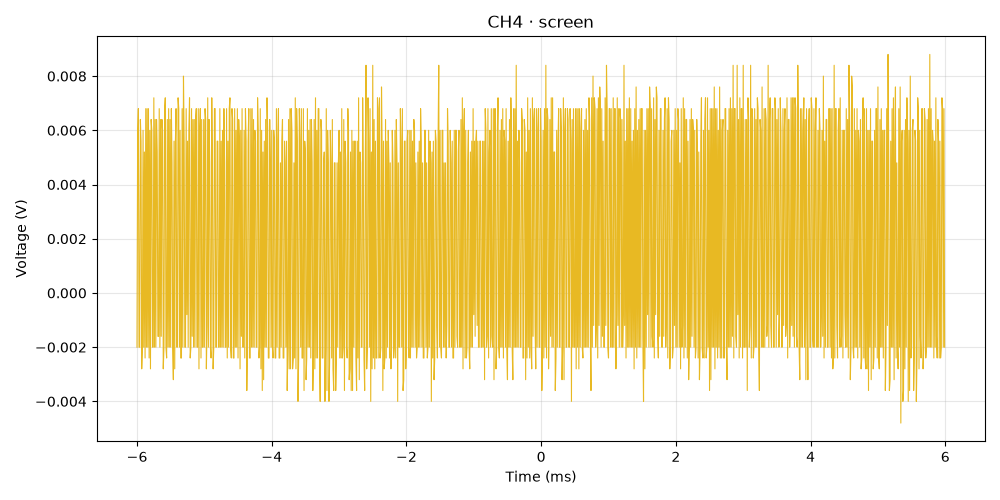
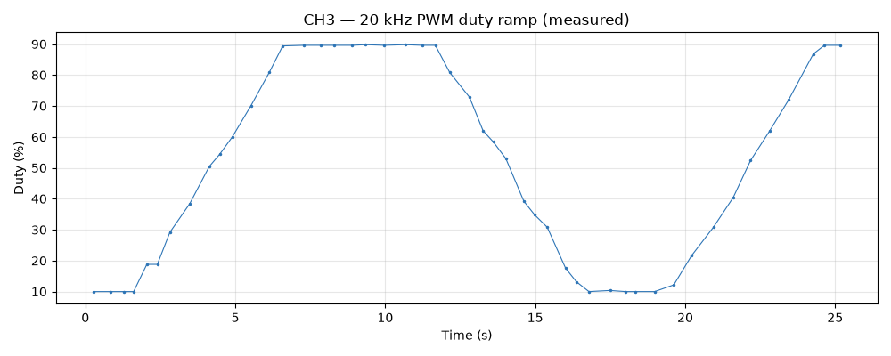

# DS1104Z — 4-Channel Bench Validation

**Instrument:** RIGOL TECHNOLOGIES DS1104Z (SN DS1ZA184753232, fw 00.04.05.SP2)  
**Date:** 2026-07-01T18:52:29  
**Transport:** raw TCP socket @ 192.168.2.2  
**Result:** 17 pass / 0 fail (rise-fall, dynamic & null rows scored separately)  

**Method:** for each channel the harness enables it, sets a vertical scale, timebase, and mid-level edge trigger sized to the signal, then runs `characterize_signal` **blind** (its reading is the *Expected* baseline), restores the timebase, and takes an independent measurement snapshot (*Measured*). CH3's duty is a moving target, sampled as a time-series.

**Tolerances:** frequency ±0.5% (CH1 mains ±2%, since line frequency wanders), Vpp/Vrms ±5%, duty ±3%; rise/fall informational.

## Summary

| Ch | Signal | Characterize |
|----|--------|--------------|
| 1 | 60 Hz sine via step-down transformer (~16.75 Vrms) | `high` |
| 2 | Rigol probe-comp square — 1 kHz, ~3 Vpp, 50% | `high` |
| 3 | 20 kHz PWM, duty ramping 10<->90% | `high` |
| 4 | Active channel, BNC open (null / noise-floor control) | `low` |

## CH1 — 60 Hz sine via step-down transformer (~16.75 Vrms)

| Quantity | Expected | Measured | %Err | Tol | Verdict |
|----------|----------|----------|------|-----|---------|
| frequency | 59.88 Hz | 60.24 Hz | 0.60% | 2.0% | PASS |
| period | 16.6 ms | 16.7 ms | 0.60% | 2.0% | PASS |
| vpp | 47.42 V | 47.42 V | 0.00% | 5.0% | PASS |
| vrms | 16.86 V | 16.86 V | 0.04% | 5.0% | PASS |
| duty | 50 % | 49.1 % | 1.80% | 3.0% | PASS |
| rise_time | 4.65 ms | 4.35 ms | — | — | INFO |
| fall_time | 4.55 ms | 4.55 ms | — | — | INFO |

## CH2 — Rigol probe-comp square — 1 kHz, ~3 Vpp, 50%

| Quantity | Expected | Measured | %Err | Tol | Verdict |
|----------|----------|----------|------|-----|---------|
| frequency | 1000 Hz | 1000 Hz | 0.00% | 0.5% | PASS |
| period | 1 ms | 1 ms | 0.00% | 0.5% | PASS |
| vpp | 3.103 V | 3.103 V | 0.00% | 5.0% | PASS |
| vrms | 2.102 V | 2.105 V | 0.12% | 5.0% | PASS |
| duty | 50 % | 50 % | 0.00% | 3.0% | PASS |
| rise_time | — | — | — | — | INFO |
| fall_time | — | — | — | — | INFO |

## CH3 — 20 kHz PWM, duty ramping 10<->90%

| Quantity | Expected | Measured | %Err | Tol | Verdict |
|----------|----------|----------|------|-----|---------|
| frequency | 20 kHz | 20 kHz | 0.00% | 0.5% | PASS |
| period | 50 µs | 50 µs | 0.00% | 0.5% | PASS |
| vpp | 12.82 V | 12.82 V | 0.00% | 5.0% | PASS |
| vrms | 11.13 V | 7.457 V | — | 5.0% | DYNAMIC (see duty series) |
| duty | 89.6 % | 25.6 % | — | 3.0% | DYNAMIC (see duty series) |
| rise_time | — | — | — | — | INFO |
| fall_time | — | — | — | — | INFO |

## CH4 — Active channel, BNC open (null / noise-floor control)

| Quantity | Expected | Measured | %Err | Tol | Verdict |
|----------|----------|----------|------|-----|---------|
| frequency | — | — | — | 0.5% | PASS (null) |
| period | — | 250 µs | — | 0.5% | REVIEW (coherent read on open input?) |
| vpp | 0.014 V | 0.0132 V | — | 5.0% | PASS (noise floor) |
| vrms | 0.004843 V | 0.004827 V | — | 5.0% | PASS (noise floor) |
| duty | — | — | — | 3.0% | PASS (null) |
| rise_time | — | — | — | — | INFO |
| fall_time | — | — | — | — | INFO |

## CH3 — duty ramp (dynamic)

Duty swept **10.0% .. 89.8%** across 48 samples (~25 s window), tracing the 10↔90% ramp.

